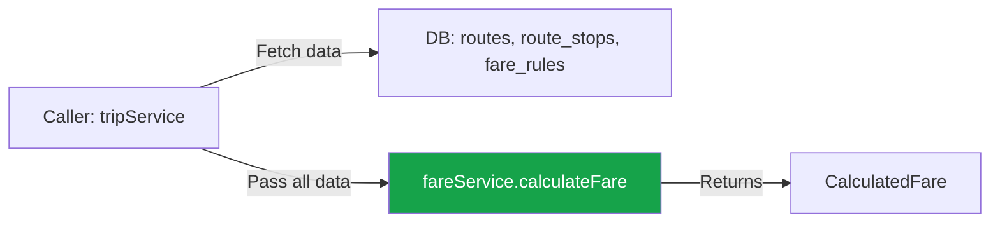
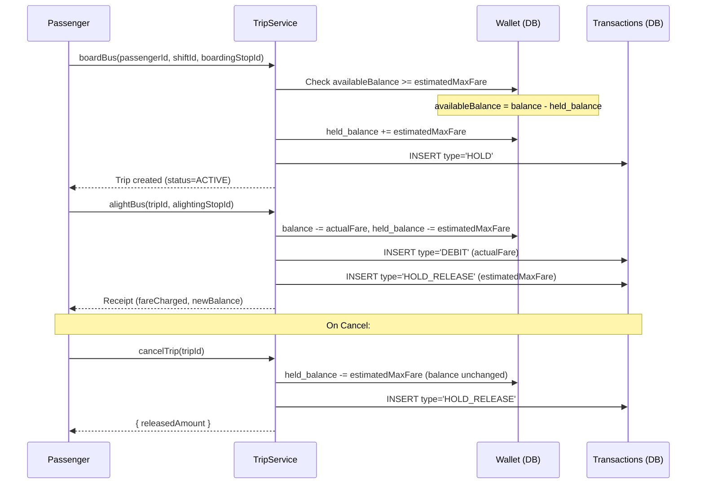

# Dynamic Fare Engine, Trip Lifecycle & Wallet Holds

Build the fare calculation engine (pure, side-effect-free), trip lifecycle management (board → alight → cancel), and wallet hold/release system for the intelligent transport platform.

## User Review Required

> [!IMPORTANT]
> **Shared types expansion** — This plan adds `RouteStop`, `FareRule`, `Trip`, `Transaction`, `TripStatus`, and `TransactionType` interfaces/enums to [index.ts](file:///home/aminul/Development/Work/intelligent-transport-app/packages/shared-types/src/index.ts) and [enums.ts](file:///home/aminul/Development/Work/intelligent-transport-app/packages/shared-types/src/enums.ts). These mirror the DB schema columns from `004_ticketing_and_fares.sql` and `002_companies_and_fleet.sql`.

> [!WARNING]
> **`AppError.badRequest` currently takes a single string** — The spec calls for `AppError.badRequest('INSUFFICIENT_BALANCE', 'Available: ...')`. The existing [AppError.ts](file:///home/aminul/Development/Work/intelligent-transport-app/apps/api/src/errors/AppError.ts#L46-L48) factory only accepts one `message` param. This plan uses the code as the message (e.g., `AppError.badRequest('INSUFFICIENT_BALANCE')`) and includes the detail in the message string, keeping the existing AppError API unchanged.

## Open Questions

1. **Peak hour wrap-around** — The spec checks `boardingTime.getHours() is between peak_start_hour and peak_end_hour`. If `peak_start_hour=22` and `peak_end_hour=6` (overnight), a simple `>= start && <= end` check fails. This plan implements a wrap-around check: if `start > end`, the condition becomes `hour >= start || hour <= end`. Confirm this is acceptable.

2. **Wallet `balance` and `held_balance` types** — The existing [Wallet](file:///home/aminul/Development/Work/intelligent-transport-app/packages/shared-types/src/index.ts#L54-L61) interface uses `string` for `balance` and `held_balance` (PostgreSQL NUMERIC arrives as string from pg driver). All arithmetic in the service layer will `parseFloat()` these values. The DB CHECK constraints remain the ultimate safety net.

3. **Transaction `wallet_id` resolution** — The spec's `INSERT INTO transactions` needs `wallet_id`. Since wallets have a UNIQUE constraint on `user_id`, we'll fetch the wallet in the same transaction and use its `id`. Alternatively, we could join, but a direct lookup is cleaner.

---

## Proposed Changes

### Shared Types Expansion

#### [MODIFY] [enums.ts](file:///home/aminul/Development/Work/intelligent-transport-app/packages/shared-types/src/enums.ts)

Add trip and transaction status enums:

```diff
+// ──────────────────────────────────────────────
+// Trips & Transactions
+// ──────────────────────────────────────────────
+
+export enum TripStatus {
+  ACTIVE = 'ACTIVE',
+  COMPLETED = 'COMPLETED',
+  CANCELLED = 'CANCELLED',
+}
+
+export enum TransactionType {
+  DEBIT = 'DEBIT',
+  CREDIT = 'CREDIT',
+  REFUND = 'REFUND',
+  HOLD = 'HOLD',
+  HOLD_RELEASE = 'HOLD_RELEASE',
+}
```

#### [MODIFY] [index.ts](file:///home/aminul/Development/Work/intelligent-transport-app/packages/shared-types/src/index.ts)

Add DB-mirroring interfaces for route_stops, fare_rules, trips, and transactions:

```typescript
/** Mirrors the route_stops table (002_companies_and_fleet.sql). */
export interface RouteStop {
  id: string;
  route_id: string;
  stop_name: string;
  latitude: string;    // NUMERIC(10,7) → string from pg
  longitude: string;
  sequence_order: number;
  distance_from_previous_km: string;  // NUMERIC(8,4) → string from pg
  estimated_travel_time_seconds: number;
}

/** Mirrors the routes table (002_companies_and_fleet.sql). */
export interface RouteRecord {
  id: string;
  company_id: string;
  name: string;
  description: string | null;
  is_active: boolean;
  base_price_per_km: string;  // NUMERIC(8,4) → string from pg
  created_at: string;
}

/** Mirrors the fare_rules table (004_ticketing_and_fares.sql). */
export interface FareRule {
  id: string;
  route_id: string;
  passenger_category: PassengerCategory;
  discount_percentage: string;  // NUMERIC(5,2) → string
  fixed_price: string | null;  // NUMERIC(10,2) → string, nullable
  peak_hour_surcharge_pct: string;
  peak_start_hour: number | null;
  peak_end_hour: number | null;
  is_active: boolean;
  created_at: string;
}

/** Mirrors the trips table (004_ticketing_and_fares.sql). */
export interface Trip {
  id: string;
  passenger_id: string;
  shift_id: string;
  boarding_stop_id: string;
  alighting_stop_id: string | null;
  estimated_max_fare: string;  // NUMERIC(10,2)
  fare_charged: string | null;
  status: TripStatus;
  boarded_at: string;
  alighted_at: string | null;
  created_at: string;
}

/** Mirrors the transactions table (004_ticketing_and_fares.sql). */
export interface Transaction {
  id: string;
  wallet_id: string;
  trip_id: string | null;
  amount: string;  // NUMERIC(12,2)
  type: TransactionType;
  description: string | null;
  created_at: string;
}

/** Mirrors the shifts table (003_driver_operations.sql). */
export interface Shift {
  id: string;
  driver_id: string;
  bus_id: string;
  route_id: string;
  started_at: string | null;
  ended_at: string | null;
  status: string;
  created_at: string;
}
```

---

### Fare Service (Pure Calculation Engine)

#### [NEW] [fare.service.ts](file:///home/aminul/Development/Work/intelligent-transport-app/apps/api/src/modules/fares/fare.service.ts)

Class `FareService` — contains both pure functions and one async method for estimated max fare.

**Type definitions (local to this file):**

```typescript
interface CalculateFareParams {
  allStops: RouteStop[];
  boardingStopId: string;
  alightingStopId: string;
  basePricePerKm: number;
  fareRule: FareRule | null;
  boardingTime: Date;
}

interface CalculatedFare {
  distanceKm: number;
  baseFare: number;
  discountApplied: boolean;
  surchargeApplied: boolean;
  finalPrice: number;
  ruleId: string | null;
}
```

**Methods:**

1. **`calculateRouteDistance(boardingStopId, alightingStopId, allStops): number`** — PURE
   - Find indices of both stops in `allStops` (by `id` match).
   - Throw `AppError.badRequest('INVALID_STOP_ORDER')` if `boardingIndex >= alightingIndex`.
   - Slice `allStops` from `(boardingIndex + 1)` to `(alightingIndex + 1)`.
   - Sum `parseFloat(stop.distance_from_previous_km)` for each stop in slice.
   - Return `Math.round(totalDistanceKm * 10000) / 10000` (4 decimal places).

   > [!NOTE]
   > `distance_from_previous_km` is the distance from the *prior* stop. For the first stop in the route, this is `0.0000`. To get the distance from stop A to stop B, we sum the `distance_from_previous_km` values of all stops *after* A, up to and including B. This is exactly `allStops.slice(boardingIndex + 1, alightingIndex + 1)`.

2. **`calculateFare(params: CalculateFareParams): CalculatedFare`** — PURE, SYNC
   - Step 1: `distanceKm = calculateRouteDistance(...)`.
   - Step 2: If `fareRule?.fixed_price` is set and not null → `finalPrice = parseFloat(fareRule.fixed_price)`, skip to Step 6. Set `baseFare = finalPrice`, `discountApplied = false`, `surchargeApplied = false`.
   - Step 3: `baseFare = distanceKm * basePricePerKm`.
   - Step 4: `discountedFare = baseFare * (1 - (parseFloat(fareRule?.discount_percentage ?? '0') / 100))`. Set `discountApplied = parseFloat(fareRule?.discount_percentage ?? '0') > 0`.
   - Step 5: Peak hour check. If `fareRule?.peak_start_hour != null && fareRule?.peak_end_hour != null`:
     - `hour = boardingTime.getHours()`
     - `start = fareRule.peak_start_hour`, `end = fareRule.peak_end_hour`
     - `isPeak = start <= end ? (hour >= start && hour <= end) : (hour >= start || hour <= end)`
     - If `isPeak`: `finalPrice = discountedFare * (1 + parseFloat(fareRule.peak_hour_surcharge_pct) / 100)`, `surchargeApplied = true`.
     - Else: `finalPrice = discountedFare`.
   - Step 6: `finalPrice = Math.max(finalPrice, 5.00)` — minimum fare 5 BDT.
   - Step 7: `finalPrice = Math.round(finalPrice * 100) / 100` — round to 2 decimal places.
   - Return `{ distanceKm, baseFare, discountApplied, surchargeApplied, finalPrice, ruleId: fareRule?.id ?? null }`.

3. **`getEstimatedMaxFare(routeId, boardingStopId, passengerCategory, boardingTime): Promise<number>`** — ASYNC (DB calls)
   - Fetch all `route_stops` for `routeId`, ordered by `sequence_order ASC`:
     ```sql
     SELECT * FROM route_stops WHERE route_id = $1 ORDER BY sequence_order ASC
     ```
   - Fetch `routes.base_price_per_km`:
     ```sql
     SELECT base_price_per_km FROM routes WHERE id = $1
     ```
   - Fetch the applicable `fare_rule`:
     ```sql
     SELECT * FROM fare_rules
     WHERE route_id = $1 AND passenger_category = $2 AND is_active = true
     LIMIT 1
     ```
   - Determine `lastStopId` = `allStops[allStops.length - 1].id`.
   - Call `calculateFare({ allStops, boardingStopId, alightingStopId: lastStopId, basePricePerKm: parseFloat(route.base_price_per_km), fareRule, boardingTime })`.
   - Return `result.finalPrice`.

---

### Trip Service (Lifecycle Management)

#### [NEW] [trip.service.ts](file:///home/aminul/Development/Work/intelligent-transport-app/apps/api/src/modules/fares/trip.service.ts)

Class `TripService` — constructor receives `fareService` instance for dependency injection.

**Methods:**

1. **`boardBus(passengerId, shiftId, boardingStopId): Promise<Trip>`**

   Validations (outside transaction):
   - Fetch shift: `SELECT * FROM shifts WHERE id = $1`. If not found or `status !== 'ACTIVE'`, throw `AppError.badRequest('SHIFT_NOT_ACTIVE')`.
   - Check no active trip: `SELECT id FROM trips WHERE passenger_id = $1 AND status = 'ACTIVE'`. If exists, throw `AppError.conflict('ACTIVE_TRIP_EXISTS')`.
   - Fetch route info from shift → get `route_id`.
   - Fetch passenger's user record to get `passenger_category`.
   - Call `fareService.getEstimatedMaxFare(routeId, boardingStopId, passengerCategory, new Date())` → `estimatedMaxFare`.
   - Check balance: `SELECT id, balance, held_balance FROM wallets WHERE user_id = $1`.
     - `availableBalance = parseFloat(wallet.balance) - parseFloat(wallet.held_balance)`.
     - If `availableBalance < estimatedMaxFare`: throw `AppError.badRequest('INSUFFICIENT_BALANCE')` with descriptive message.

   Transaction (atomic):
   ```sql
   -- a. Create trip
   INSERT INTO trips (passenger_id, shift_id, boarding_stop_id, estimated_max_fare, status)
   VALUES ($1, $2, $3, $4, 'ACTIVE') RETURNING *

   -- b. Hold funds in wallet
   UPDATE wallets SET held_balance = held_balance + $1, updated_at = NOW()
   WHERE user_id = $2

   -- c. Record HOLD transaction
   INSERT INTO transactions (wallet_id, trip_id, amount, type, description)
   VALUES ($1, $2, $3, 'HOLD', 'Fare reserved for trip ${tripId}')
   ```

   Return: the created trip record.

2. **`alightBus(tripId, alightingStopId): Promise<AlightReceipt>`**

   ```typescript
   interface AlightReceipt {
     tripId: string;
     fareCharged: number;
     distanceKm: number;
     routeName: string;
     boardingStop: string;
     alightingStop: string;
     newBalance: string;
     newHeldBalance: string;
   }
   ```

   Pre-transaction:
   - Fetch trip: `SELECT * FROM trips WHERE id = $1`. Validate `status === 'ACTIVE'`.
   - Fetch shift → route → route name.
   - Fetch all `route_stops` ordered by `sequence_order`.
   - Fetch `routes.base_price_per_km`.
   - Fetch applicable `fare_rule`.
   - Call `fareService.calculateFare(...)` → `fareResult`.
   - Look up boarding/alighting stop names from the fetched stops.

   Transaction (atomic):
   ```sql
   -- a. Complete trip
   UPDATE trips SET status = 'COMPLETED', alighting_stop_id = $1,
     fare_charged = $2, alighted_at = NOW()
   WHERE id = $3

   -- b. Settle wallet (single UPDATE — both balance and held_balance)
   UPDATE wallets SET
     balance = balance - $1,          -- deduct actual fare
     held_balance = held_balance - $2, -- release the hold
     updated_at = NOW()
   WHERE user_id = $3 RETURNING balance, held_balance

   -- c. Record DEBIT transaction
   INSERT INTO transactions (wallet_id, trip_id, amount, type, description)
   VALUES ($1, $2, $3, 'DEBIT', 'Fare charged for trip ${tripId}')

   -- d. Record HOLD_RELEASE transaction
   INSERT INTO transactions (wallet_id, trip_id, amount, type, description)
   VALUES ($1, $2, $3, 'HOLD_RELEASE', 'Hold released on trip completion')
   ```

   Return: `AlightReceipt` with all fields populated from query results.

3. **`cancelTrip(tripId): Promise<{ tripId: string; releasedAmount: number }>`**

   - Fetch trip, validate `status === 'ACTIVE'`.
   - Transaction:
     ```sql
     -- a. Cancel trip
     UPDATE trips SET status = 'CANCELLED' WHERE id = $1

     -- b. Release hold (balance unchanged — no fare charged)
     UPDATE wallets SET
       held_balance = held_balance - $1,
       updated_at = NOW()
     WHERE user_id = $2

     -- c. Record HOLD_RELEASE
     INSERT INTO transactions (wallet_id, trip_id, amount, type, description)
     VALUES ($1, $2, $3, 'HOLD_RELEASE', 'Hold released on trip cancellation')
     ```
   - Return `{ tripId, releasedAmount: parseFloat(trip.estimated_max_fare) }`.

---

### Wallet Service

#### [NEW] [wallet.service.ts](file:///home/aminul/Development/Work/intelligent-transport-app/apps/api/src/modules/fares/wallet.service.ts)

Class `WalletService`:

**Methods:**

1. **`getBalance(userId): Promise<WalletBalance>`**
   ```typescript
   interface WalletBalance {
     balance: string;
     held_balance: string;
     availableBalance: number;
     currency: string;
   }
   ```
   - `SELECT balance, held_balance, currency FROM wallets WHERE user_id = $1`.
   - `availableBalance = parseFloat(balance) - parseFloat(held_balance)`.

2. **`topUp(userId, amount, paymentMethod): Promise<Transaction>`**
   - Validate `amount > 0 && amount <= 100000` — anti-fraud ceiling.
   - Transaction:
     ```sql
     UPDATE wallets SET balance = balance + $1, updated_at = NOW()
     WHERE user_id = $2 RETURNING *

     INSERT INTO transactions (wallet_id, trip_id, amount, type, description)
     VALUES ($1, NULL, $2, 'CREDIT', 'Wallet top-up via ${paymentMethod}')
     RETURNING *
     ```

3. **`getTransactionHistory(userId, page, limit): Promise<PaginatedResponse<Transaction>>`**
   - Paginated query:
     ```sql
     SELECT t.* FROM transactions t
     JOIN wallets w ON w.id = t.wallet_id
     WHERE w.user_id = $1
     ORDER BY t.created_at DESC
     LIMIT $2 OFFSET $3
     ```
   - Count: `SELECT COUNT(*) ...` for total.
   - Return `{ items, total, page, limit }`.

---

### Controllers & Routes

#### [NEW] [fare.controller.ts](file:///home/aminul/Development/Work/intelligent-transport-app/apps/api/src/modules/fares/fare.controller.ts)

Express router exporting `fareRouter` with endpoints:

| Method | Path | Auth | Description |
|--------|------|------|-------------|
| POST | `/trips/board` | authenticate (PASSENGER) | Board a bus — creates trip + hold |
| POST | `/trips/:tripId/alight` | authenticate (PASSENGER) | Alight from bus — settles fare |
| POST | `/trips/:tripId/cancel` | authenticate (PASSENGER) | Cancel active trip — releases hold |
| GET | `/wallet/balance` | authenticate | Get wallet balance |
| POST | `/wallet/top-up` | authenticate | Top up wallet |
| GET | `/wallet/transactions` | authenticate | Paginated transaction history |

#### [NEW] [fare.validation.ts](file:///home/aminul/Development/Work/intelligent-transport-app/apps/api/src/modules/fares/fare.validation.ts)

Zod schemas:
- `BoardBusDto`: `{ shiftId: z.string().uuid(), boardingStopId: z.string().uuid() }`
- `AlightBusDto`: `{ alightingStopId: z.string().uuid() }`
- `TopUpDto`: `{ amount: z.number().positive().max(100000), paymentMethod: z.string().min(1) }`
- `TransactionHistoryQuery`: `{ page: z.coerce.number().int().positive().default(1), limit: z.coerce.number().int().min(1).max(100).default(20) }`

#### [MODIFY] [routes/v1/index.ts](file:///home/aminul/Development/Work/intelligent-transport-app/apps/api/src/routes/v1/index.ts)

```diff
 import { authRouter } from '../../modules/auth/auth.controller';
+import { fareRouter } from '../../modules/fares/fare.controller';

 v1Router.use('/auth', authRouter);
+v1Router.use('/fares', fareRouter);
```

---

## File Summary

| # | File | Action | Lines (est.) |
|---|------|--------|-------------|
| 1 | `packages/shared-types/src/enums.ts` | MODIFY — add `TripStatus`, `TransactionType` enums | +15 |
| 2 | `packages/shared-types/src/index.ts` | MODIFY — add `RouteStop`, `RouteRecord`, `FareRule`, `Trip`, `Transaction`, `Shift` interfaces | +80 |
| 3 | `apps/api/src/modules/fares/fare.service.ts` | NEW — pure fare calculator + estimated max fare | ~200 |
| 4 | `apps/api/src/modules/fares/trip.service.ts` | NEW — board/alight/cancel lifecycle | ~280 |
| 5 | `apps/api/src/modules/fares/wallet.service.ts` | NEW — balance, top-up, transaction history | ~140 |
| 6 | `apps/api/src/modules/fares/fare.controller.ts` | NEW — Express routes | ~130 |
| 7 | `apps/api/src/modules/fares/fare.validation.ts` | NEW — Zod schemas | ~40 |
| 8 | `apps/api/src/routes/v1/index.ts` | MODIFY — mount fareRouter | +3 |

---

## Architecture Decisions

### Why `calculateFare` Is Pure

The fare engine's core calculation (`calculateFare`) is a **pure synchronous function** — zero database calls, zero async, zero side effects. All inputs (stops, prices, rules) are pre-fetched by the caller and passed in as parameters. This design:

- **Enables exhaustive unit testing** without mocking databases.
- **Separates concerns**: data-fetching (impure) vs. business logic (pure).
- **Makes fare calculation deterministic** and auditable.



### Wallet Hold Lifecycle



### Key Invariants

| Invariant | Enforcement |
|-----------|------------|
| `balance >= 0` | DB `CHECK (balance >= 0)` + app-layer pre-check |
| `held_balance >= 0` | DB `CHECK (held_balance >= 0)` |
| Available = balance − held | Computed, never stored |
| One active trip per passenger | App-layer check before `boardBus` |
| Minimum fare = 5 BDT | Enforced in `calculateFare` Step 6 |
| Anti-fraud top-up ceiling | 100,000 BDT max per `topUp` call |

---

## Verification Plan

### Automated Tests

1. **TypeScript compilation check**:
   ```bash
   cd apps/api && npx tsc --noEmit
   ```
   All new files must compile without errors against the existing strict tsconfig.

2. **Unit tests: `fare.service.ts`** — Pure functions, fully testable:
   - `calculateRouteDistance`: valid range, reversed stops (should throw), adjacent stops, full route.
   - `calculateFare`: distance-based pricing, fixed price override, discount application, peak hour surcharge, minimum fare floor, peak hour wrap-around.

3. **Unit tests: `wallet.service.ts`**:
   - `topUp` with valid/invalid amounts, boundary (0, 100001).
   - `getBalance` returns correct `availableBalance`.

4. **Integration tests: `trip.service.ts`** (requires DB):
   - Full board → alight flow: verify wallet balance changes.
   - Board → cancel flow: verify only held_balance decreases.
   - Board with insufficient balance: expect error.
   - Board with active trip: expect conflict error.

### Manual Verification

- Verify the complete lifecycle via API endpoints:
  1. Top up wallet → Check balance.
  2. Board bus → Verify held_balance increases, available balance decreases.
  3. Alight → Verify fare charged, held_balance released, balance reduced.
  4. Check transaction history shows CREDIT → HOLD → DEBIT → HOLD_RELEASE.
